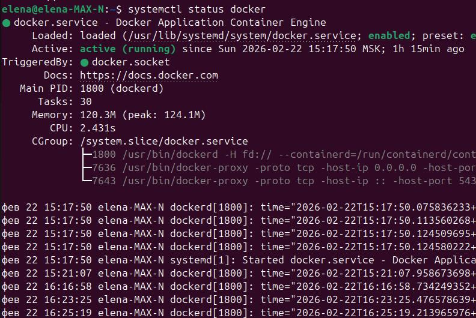
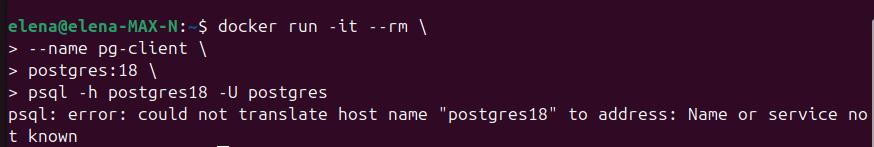
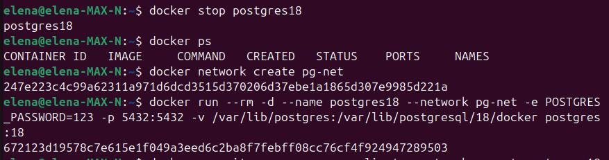
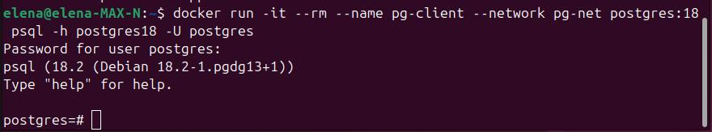
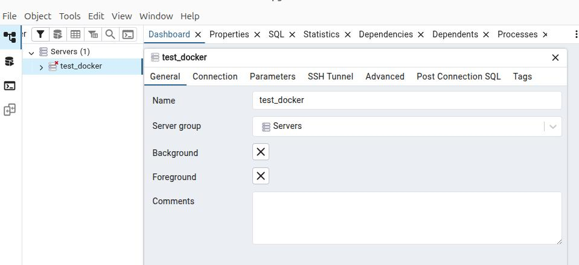
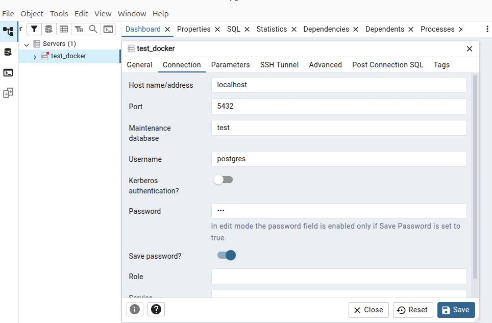
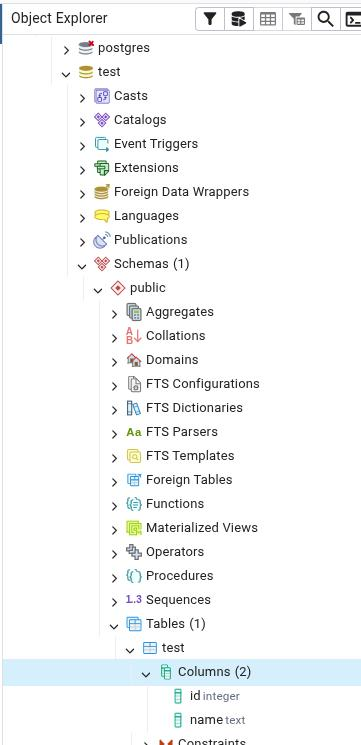
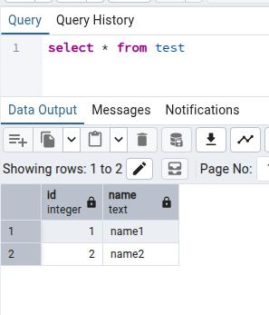
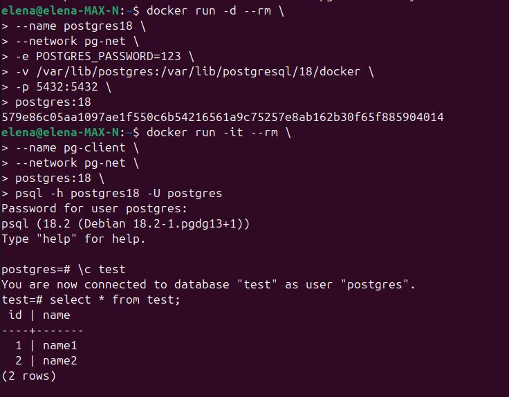

## Поставить DockerEngine
```sh
curl -fsSL https://get.docker.com -o get-docker.sh
sudo sh get-docker.sh
rm get-docker.sh
sudo usermod -aG docker $USER
newgrp docker
```
Проверка работы:
```sh
systemctl status docker
```


## Сделать каталог /var/lib/postgres

```sh
elena@elena-MAX-N:~$ sudo mkdir -p /var/lib/postgres
elena@elena-MAX-N:~$ ls /var/lib
AccountsService      git                    shim-signed
alsa                 gnome-remote-desktop   snapd
app-info             grub                   snmp
apport               hp                     sss
apt                  ieee-data              sudo
aspell               ispell                 swcatalog
bluetooth            libuuid                systemd
boltd                locales                tpm
BrlAPI               logrotate              ubuntu-advantage
cloud                man-db                 ubuntu-drivers-common
colord               misc                   ubuntu-release-upgrader
command-not-found    NetworkManager         ucf
containerd           openvpn                udisks2
dbus                 os-prober              unattended-upgrades
dhcpcd               PackageKit             update-manager
dictionaries-common  pam                    update-notifier
docker               plymouth               upower
dpkg                 polkit-1               usb_modeswitch
emacsen-common       postgres               vim
foo2zjs              power-profiles-daemon  whoopsie
fprint               private                xfonts
fwupd                python                 xkb
gdm3                 saned                  xml-core
geoclue              sgml-base
ghostscript          shells.state

```
             
## Развернуть контейнер с PostgreSQL, смонтировав в него /var/lib/postgres      
```sh
elena@elena-MAX-N:~$ docker run --rm -d \
> --name postgres18 \
> -e POSTGRES_PASSWORD=123 \
> -p 5432:5432 \
> -v /var/lib/postgres:/var/lib/postgresql/18/docker \
> postgres:18
Unable to find image 'postgres:18' locally
18: Pulling from library/postgres
0c8d55a45c0d: Downloading  10.49MB/29.78MB
0c8d55a45c0d: Pull complete 
dde5569f086b: Pull complete 
ead3bf55c003: Pull complete 
c6f633039419: Pull complete 
ae2a61803f45: Pull complete 
97d92c993d8c: Pull complete 
659362c5a0b7: Pull complete 
b3892cfe5fd0: Pull complete 
271cc796df4f: Pull complete 
9ebad2bb4202: Pull complete 
777cc89ca451: Pull complete 
0d47a78b3257: Pull complete 
698873b94b0d: Pull complete 
f00d75aa906e: Download complete 
21ebeb2eb594: Download complete 
Digest: sha256:b6b4d0b75c699a2c94dfc5a94fe09f38630f3b67ab0e1653ede1b7ac8e13c197
Status: Downloaded newer image for postgres:18
33282269fae9b2688295f268a328a0a43e4390d387ca15e2c8fd8a0348881197
             
```


## Развернуть контейнер с клиентом postgres


Ошибка - новый контейнер не видит контейнер postgres18. Они должны работать в одной сети. 
Решение - создаем новую сеть:

Теперь контейнер с клиентом запускается без ошибки:


## Подключиться из контейнера с клиентом к контейнеру с сервером и сделать таблицу с парой строк
Создаю базу данных test, переключаюсь на эту базу, создаю в этой базе таблицу test и вставляю в нее две строки:


## Подключиться к контейнеру с компьютера
Устанавливаю pgAdmin4 на своем компьютере:
```sh
curl -fsS https://www.pgadmin.org/static/packages_pgadmin_org.pub | sudo gpg --dearmor -o /usr/share/keyrings/packages-pgadmin-org.gpg

sudo sh -c 'echo "deb [signed-by=/usr/share/keyrings/packages-pgadmin-org.gpg] https://ftp.postgresql.org/pub/pgadmin/pgadmin4/apt/$(lsb_release -cs) pgadmin4 main" > /etc/apt/sources.list.d/pgadmin4.list && apt update'

sudo apt install pgadmin4
```
Открываю pgAdmin4 и создаю подключение к контейнеру:



Сначала не получалось подключиться, после нажатия на кнопку Save интерфейс зависал.
Перезапуск pgAdmin не помог. 
Смотрела логи с помощью команды:
```sh
tail -f ~/.pgadmin/pgadmin4.log
```
В логах ничего не было. 
После перезагрузки системы ошибка пропала, подключение прошло успешно. 
Проверяю, что база данных и таблица видны:

и запрос к таблице выполняется:


## Удалить контейнер с сервером
```sh
docker stop postgres18
```
Так как контейнер запускался с флагом --rm, то при остановке он удаляется. 
Проверка:


## Создать его заново
```sh
docker run -d --rm \
> --name postgres18 \
> --network pg-net \
> -e POSTGRES_PASSWORD=123 \
> -v /var/lib/postgres:/var/lib/postgresql/18/docker \
> -p 5432:5432 \
> postgres:18
```

## Подключиться снова из контейнера с клиентом к контейнеру с сервером
```sh
docker run -it --rm \
> --name pg-client \
> --network pg-net \
> postgres:18 \
> psql -h postgres18 -U postgres
```
## Проверить, что данные остались на месте
```sql
select * from test;
```

Запрос выполняется, т.е. база данных и таблица остались на месте. 
