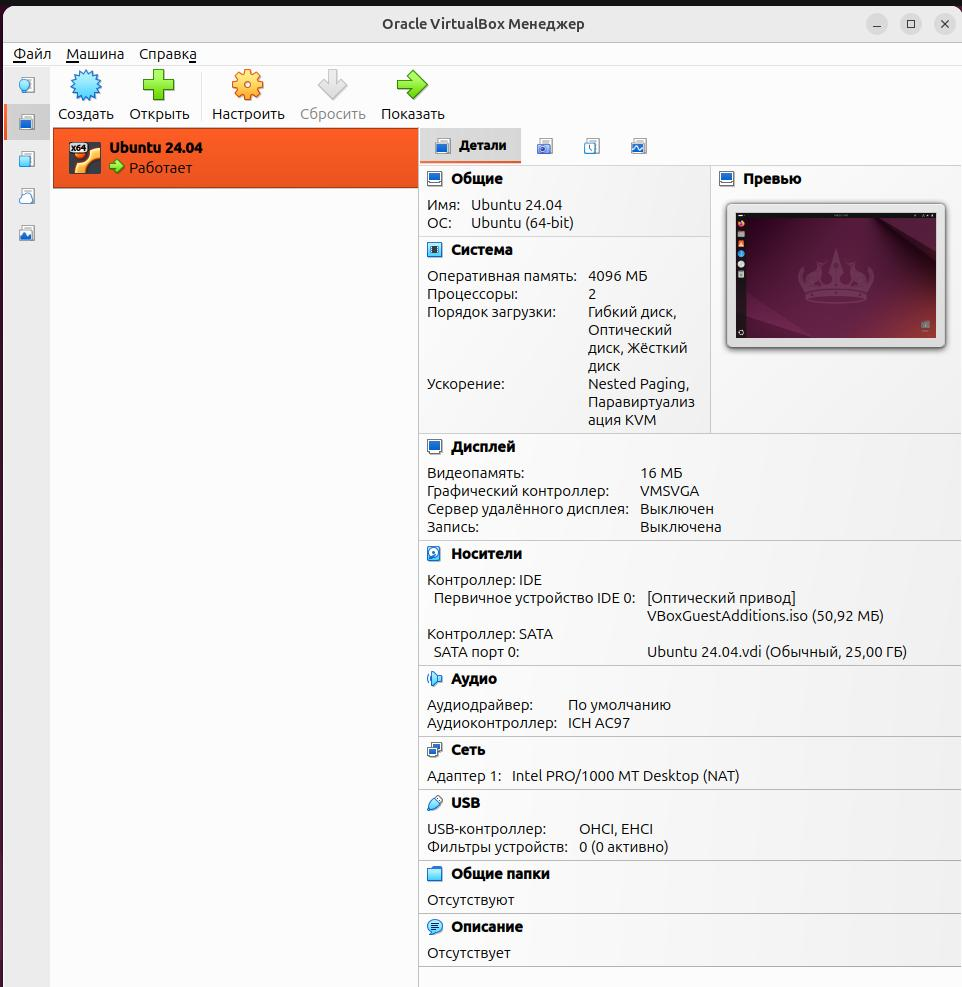
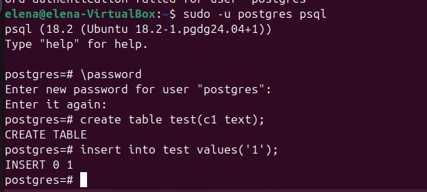
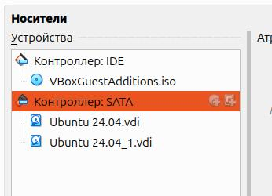
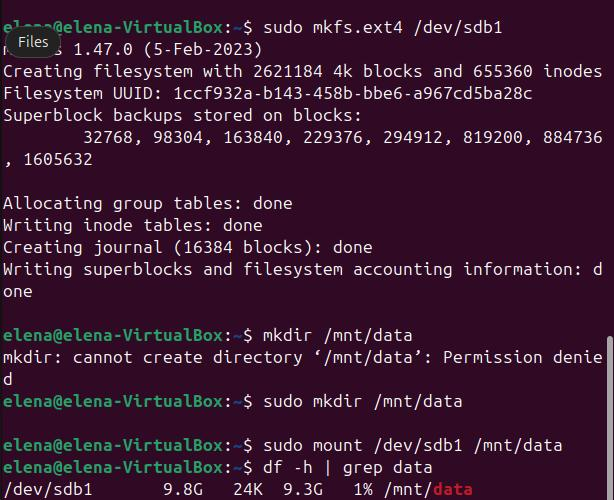
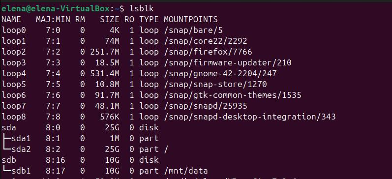
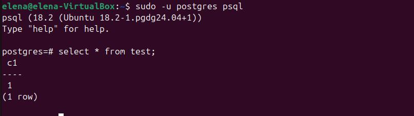

## Cоздать виртуальную машину c Ubuntu 22.04/24.04 LTS в ЯО/Virtual Box/Docker



## Поставить на нее PostgreSQL через sudo apt

```sh
sudo apt install -y postgresql-common
sudo /usr/share/postgresql-common/pgdg/apt.postgresql.org.sh
sudo apt install -y postgresql-18
```

## Проверить, что кластер запущен через sudo -u postgres pg_lsclusters


## Зайти из под пользователя postgres в psql и сделайте произвольную таблицу с произвольным содержимым

```sh
sudo -u postgres psql
postgres=# create table test(c1 text);
postgres=# insert into test values('1');
```


## Остановить postgres например через sudo -u postgres pg_ctlcluster 17 main stop

```sh
sudo -u postgres pg_ctlcluster 18 main stop
```


## Cоздать новый диск к ВМ размером 10GB


## Добавить свеже-созданный диск к виртуальной машине

    
## Проинициализировать диск согласно инструкции и подмонтировать файловую систему
```sh
sudo fdisk /dev/sdb
sudo mkfs.ext4 /dev/sdb1
sudo mkdir /mnt/data
sudo mount /dev/sdb1 /mnt/data
```
  
  

## Перезагрузить инстанс и убедится, что диск остается примонтированным
```sh
sudo lsblk
```
Диск не примонтирован. Редактирую файл /etc/fstab. Для этого сначала получаю UUID диска:
```sh
sudo blkid /dev/sdb1
```
Затем через mc добавляю в файл /etc/fstab строку с этим UUID:


Проверяю, теперь диск примонтирован:


## Cделать пользователя postgres владельцем /mnt/data

```sh
sudo chown -R postgres:postgres /mnt/data/
```
## Перенести содержимое /var/lib/postgres/18 в /mnt/data
```sh
sudo mv /var/lib/postgresql/18 /mnt/data
```
Проверка:


## Попытаться запустить кластер
```sh
sudo -u postgres pg_ctlcluster 18 main start
```
Получила ошибку:

Причина ошибки - директория /var/lib/postgresql/18/main больше не существует. 

## Задание: найти конфигурационный параметр в файлах раположенных в /etc/postgresql/17/main который надо поменять и поменяйте его
Редактирую файл postgresql.conf, меняю параметр
```text
data_directory = '/mnt/data/18/main'
```
Теперь кластер запустился: 


## Зайти через через psql и проверить содержимое ранее созданной таблицы
```sh
sudo -u postgres psql
postgres=# select * from test;
```
Таблица и данные осталась на месте:

