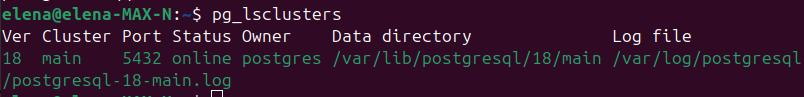
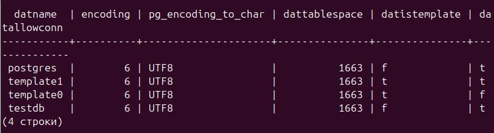
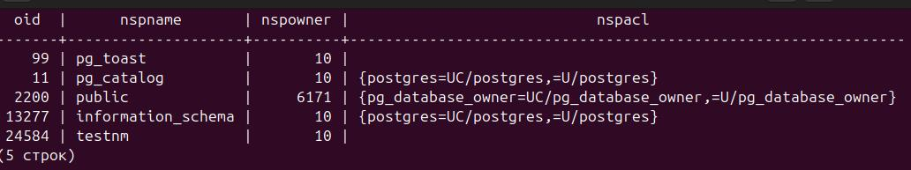
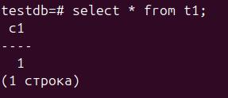
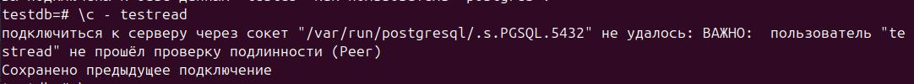
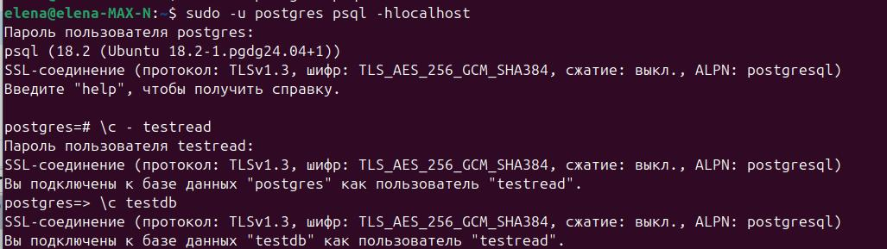
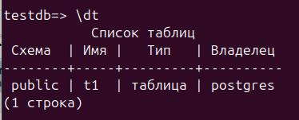
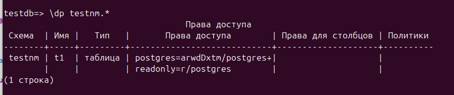
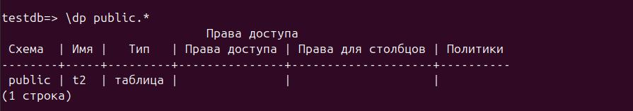

##Создать новый кластер PostgresSQL 18
```sh
sudo apt install -y postgresql-common
sudo /usr/share/postgresql-common/pgdg/apt.postgresql.org.sh
sudo apt install -y postgresql-18
```

##Зайти в созданный кластер под пользователем postgres
```sh
sudo -u postgres psql
```
##Создать новую базу данных testdb
```sql
create database testdb;
```
Проверка:
```sql
testdb=# select datname, encoding, pg_encoding_to_char(encoding), 
testdb-# dattablespace, datistemplate, datallowconn
testdb-# from pg_database;
testdb=# select datname, encoding, pg_encoding_to_char(encoding), 
dattablespace, datistemplate, datallowconn
from pg_database;
```


##Зайти в созданную базу данных под пользователем postgres
```sql
postgres=# \c testdb;
Вы подключены к базе данных "testdb" как пользователь "postgres".
```
##Создать новую схему testnm
```sql
create schema testnm;
```
Проверка:
```sql
select * from pg_namespace;
```


##создать новую таблицу t1 с одной колонкой c1 типа integer
```sql
create table t1(c1 int);
```
##вставить строку со значением c1=1
```sql
insert into t1(c1) values(1);
```
Проверка:
```sql
select * from t1;
```


##Создать новую роль readonly
```sql
create role readonly;
```
##Дать новой роли право на подключение к базе данных testdb
```sql
  GRANT CONNECT ON DATABASE testdb TO readonly;
```
##Дать новой роли право на использование схемы testnm
```sql
 GRANT USAGE ON SCHEMA testnm TO readonly;
```
##Дать новой роли право на select для всех таблиц схемы testnm
```sql
  GRANT SELECT ON ALL TABLES IN SCHEMA testnm TO readonly;
```
##Создать пользователя testread с паролем test123
```sql
 CREATE USER testread PASSWORD 'test123';
```
##Дать роль readonly пользователю testread
```sql
  GRANT readonly TO testread;
```
##Зайти под пользователем testread в базу данных testdb
```sql
testdb=# \c - testread 
```
Ошибка: "подключиться к серверу через сокет "/var/run/postgresql/.s.PGSQL.5432" не удалось: ВАЖНО:  пользователь "testread" не прошёл проверку подлинности (Peer)"

Причина ошибки: При запуске psql не указывали соединение, поэтому peer аутентификация через unix socket, а в unix нет пользователя testread.

Подключаюсь повторно:
```sh
sudo -u postgres psql -hlocalhost
postgres=# \c - testread
postgres=> \c testdb
```
Успешно:

  
##Сделать select * from t1;
```sql
testdb=> select * from t1;
ОШИБКА:  нет доступа к таблице t1
```
Ошибка - нет доступа к таблице. 
У текущего пользователя testread должен быть доступ на select из всех таблиц схемы testnm. При создании таблицы t1 схема не указывалась. Проверяю, в какой схеме создалась таблица t1:

Таблица t1 находится в схеме public, у пользователя testread нет прав просматривать таблицы в схеме public, поэтому произошла ошибка. 
```sql
testdb=> select current_schema();
 current_schema 
----------------
 public
(1 строка)
```
Текущая схема - public, поэтому таблица была создана в этой схеме.

##Вернуться в базу данных testdb под пользователем postgres
```sql
testdb=> \c - postgres
Пароль пользователя postgres: 
SSL-соединение (протокол: TLSv1.3, шифр: TLS_AES_256_GCM_SHA384, сжатие: выкл., ALPN: postgresql)
Вы подключены к базе данных "testdb" как пользователь "postgres".
```

##Удалить таблицу t1
```sql
testdb=# drop table t1;
DROP TABLE
```

##Создайте ее заново но уже с явным указанием имени схемы testnm
```sql
testdb=# create table testnm.t1(c1 int);
CREATE TABLE
```

##Вставить строку со значением c1=1
```sql
testdb=# insert into testnm.t1(c1) values(1);
INSERT 0 1
```

##Зайти под пользователем testread в базу данных testdb
```sql
testdb=# \c - testread
Пароль пользователя testread: 
SSL-соединение (протокол: TLSv1.3, шифр: TLS_AES_256_GCM_SHA384, сжатие: выкл., ALPN: postgresql)
Вы подключены к базе данных "testdb" как пользователь "testread".
```

##    сделайте select * from testnm.t1;
```sql
testdb=> select * from testnm.t1;
ОШИБКА:  нет доступа к таблице t1
```
Таблица testnm.t1 была создана уже после того, как были выданы права на схему testnm. Повторить выдачу прав:
```sql
testdb=> \c - postgres
Пароль пользователя postgres: 
SSL-соединение (протокол: TLSv1.3, шифр: TLS_AES_256_GCM_SHA384, сжатие: выкл., ALPN: postgresql)
Вы подключены к базе данных "testdb" как пользователь "postgres".
testdb=> GRANT SELECT ON ALL TABLES IN SCHEMA testnm TO readonly;
GRANT
testdb=# \c - testread
Пароль пользователя testread: 
SSL-соединение (протокол: TLSv1.3, шифр: TLS_AES_256_GCM_SHA384, сжатие: выкл., ALPN: postgresql)
Вы подключены к базе данных "postgres" как пользователь "testread".
testdb=> select * from testnm.t1;
 c1 
----
  1
(1 строка)
```
Проверяю права на таблицу:

Видно, что у роли readonly есть права \r (чтение) таблицы testnm.t1;

##Как сделать так чтобы такое больше не повторялось?
Дать роли readonly права на SELECT из всех таблиц, которые будут созданы в схеме  testnm:
```sql
alter default privileges in schema testnm GRANT SELECT ON TABLES TO readonly;
```
##Теперь попробуйте выполнить команду create table t2(c1 integer); insert into t2 values (2);
```sql
testdb=> create table t2(c1 integer); insert into t2 values (2);
ОШИБКА:  нет доступа к схеме public
СТРОКА 1: create table t2(c1 integer);
                       ^
ОШИБКА:  отношение "t2" не существует
СТРОКА 1: insert into t2 values (2);
```
У пользователя testread нет прав на создаие таблиц в схеме по-умолчанию - public. Нужно дать ему права:
```sql
GRANT CREATE ON SCHEMA public TO readonly;
```
Теперь можно создать таблицу:
```sql
testdb=> create table t2(c1 integer); 
CREATE TABLE
testdb=> insert into t2 values (2);
INSERT 0 1
```
Вставить в таблицу значение получилось без выдачи специальных прав, так как пользователь testread является владельцем таблицы
Проверяю права для таблиц в схеме public:

Для таблицы t2 столбец "Права доступа" пуст, значит, для этого объекта действуют стандартные права (все права для владельца и некоторые права для PUBLIC). 
