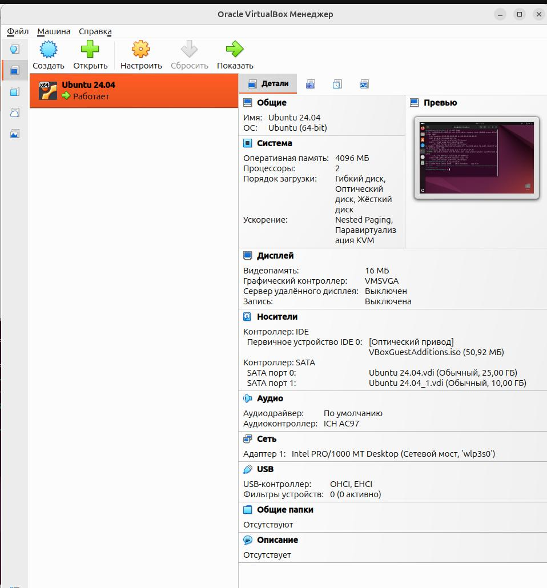
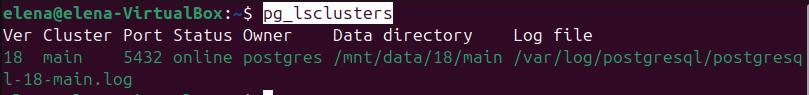

## Развернуть виртуальную машину любым удобным способом



## Поставить на неё PostgreSQL 18 любым способом
```sh
sudo apt install -y postgresql-common
sudo /usr/share/postgresql-common/pgdg/apt.postgresql.org.sh
sudo apt install -y postgresql-18
pg_lsclusters
```


## Настроить кластер PostgreSQL 18 на максимальную производительность не обращая внимание на возможные проблемы с надежностью в случае аварийной перезагрузки виртуальной машины
## Нагрузить кластер через утилиту через утилиту pgbench (https://postgrespro.ru/docs/postgrespro/18/pgbench)

Для тестирования производительности postgres запускаю утилиту pgbench со следующими параметрами:
```sh
pgbench -c 50 -j 2 -P 10 -T 60 test
```
* Число имитируемых клиентов c = 50
* Число рабочих потоков j = 2
* Выводить отчёт о прогрессе через P = 10 с
* Выполнять тест T = 60 c

При настройках по-умолчанию: 
tps = 343.249988

### Параметры CPU

```sql
select *
from pg_settings
where name in ('max_worker_processes',
'max_parallel_workers_per_gather',
'max_parallel_workers',
'max_parallel_maintenance_workers');

alter system set max_worker_processes = 2;
alter system set max_parallel_workers_per_gather = 1;
alter system set max_parallel_workers = 2;
alter system set max_parallel_maintenance_workers = 1;
```
Стояли следующие значения по-умолчанию:
* max_worker_processes = 8
* max_parallel_workers_per_gather = 2
* max_parallel_workers = 8
* max_parallel_maintenance_workers = 2

Устанавливаю следующие значения:
* max_worker_processes = 2  (два ядра ЦПУ)
* max_parallel_workers_per_gather = 1 (max_parallel_workers / 2)
* max_parallel_workers = 2 (два ядра ЦПУ)
* max_parallel_maintenance_workers = 1 (max_parallel_workers / 2)

При тестировании производительности получаю следующее значение:
tps = 356.250690

tps увеличился, оставляю установленные значения.

### RAM: Shared memory
```sql
select *
from pg_settings
where name in ('shared_buffers', 'effective_cache_size');

alter system set shared_buffers = 209715;
alter system set effective_cache_size = 314573;
```

Стояли следующие значения по-умолчанию:
* effective_cache_size = 524288 x 8kB (100% ОЗУ)
* shared_buffers = 16384 x 8kB (1/32 или 3,1% ОЗУ)

Всего ОЗУ: 4096 Мб х 1024 = 4194304 Кб = 524288 x 8kB

Устанавливаю следующие значения:
* shared_buffers = 209715 x 8kB (40% ОЗУ)
* effective_cache_size = 314573 x 8kB (60% ОЗУ, т.к. shared_buffers + effective_cache_size <= ОЗУ )

tps = 355.005122 - остался примерно как был, оставляю установленные значения

### RAM: Backend memory
```sql
select *
from pg_settings
where name in ('temp_buffers',
'work_mem', 'maintenance_work_mem');

alter system set temp_buffers = '8MB';
alter system set work_mem = '32MB';
select pg_reload_conf();

alter system set maintenance_work_mem = '64MB';
```

Стояли следующие значения по-умолчанию:
* maintenance_work_mem = 65536 kB
* temp_buffers = 1024 x 8kB
* work_mem = 4096 kB

Устанавливаю следующие значения:
* work_mem = 32 MB - максимально увеличиваю для предполагаемой OLTP нагрузки.  
Остальные параметры оставляю без изменения. 

tps = 363.483603 - изменился незначительно.

### Настройки дисковой подсистемы
```sql
select *
from pg_settings
where name in ('fsync',
'synchronous_commit', 'checkpoint_completion_target', 
'effective_io_concurrency', 'random_page_cost');

alter system set fsync = 'off';
select pg_reload_conf();

alter system set synchronous_commit = 'off';
select pg_reload_conf();

alter system set checkpoint_completion_target = 0.9;

alter system set effective_io_concurrency = 16;
select pg_reload_conf();

alter system set random_page_cost = 4;
select pg_reload_conf();
```

Стояли следующие значения по-умолчанию:
* checkpoint_completion_target = 0.9
* effective_io_concurrency = 16
* fsync = on
* random_page_cost = 4
* synchronous_commit = on

Устанавливаю следующие значения:
* fsync = off - процессы будут идти быстрее в ущерб надежности. 

tps = 1358.571153 - увеличилось в 4 раза!

* synchronous_commit = off
tps = 1337.630953

* effective_io_concurrency = 2
tps = 1310.281865 - уменьшилось, возвращаю прежнее значение:

* effective_io_concurrency = 16
tps = 1373.304136

* random_page_cost = 2
tps = 1365.075193 - немного уменьшилось, возвращаю прежнее значение

## Написать какого значения tps удалось достичь, показать какие параметры в какие значения устанавливали и почему

В результате настройки кластера получилось увеличить значение tps c 343.249988 до 1373.304136. 
Самое большое влияние оказал параметр fsync. При установки его значения в off отключили принудительное сбрасывание на диск данные с кэша ОС. Таким образом, при увеличении производительности увеличилась также вероятность потери данных.  
Изменение остальных параметров незначительно повлияло на увеличение tps. 
