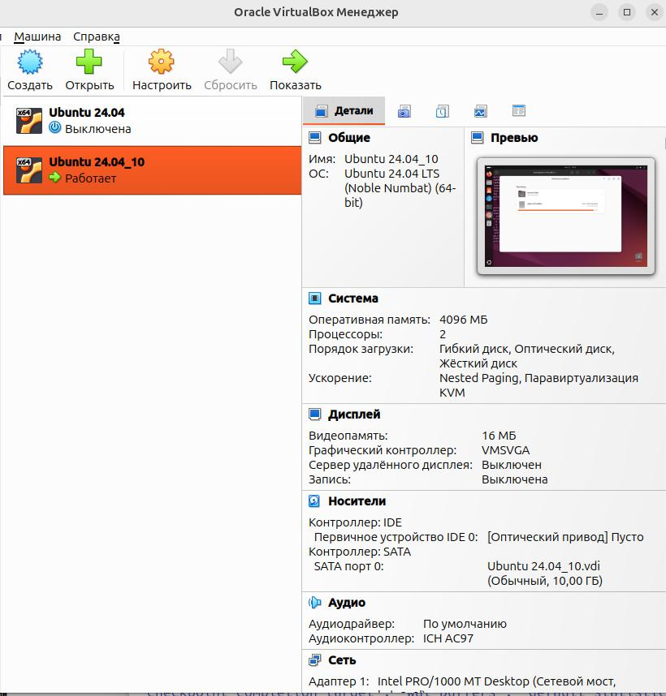
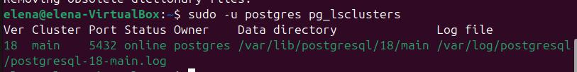
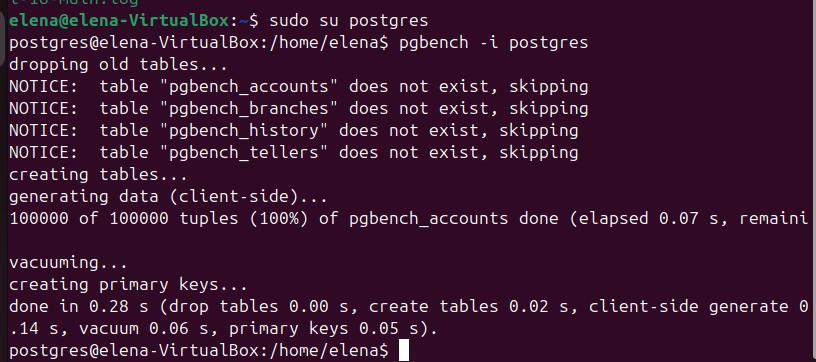
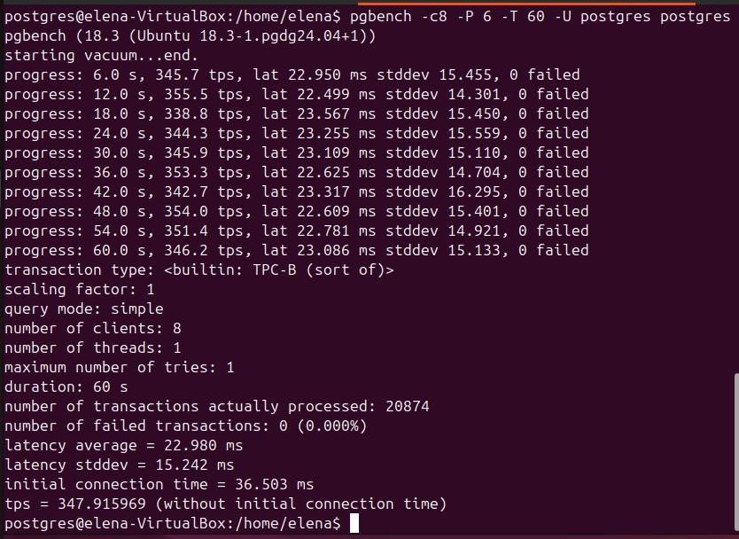
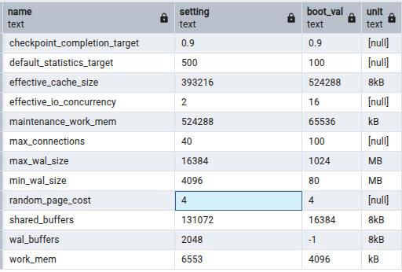
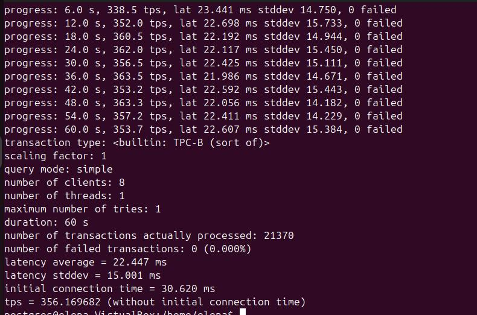

## Создать инстанс ВМ с 2 ядрами и 4 Гб ОЗУ и SSD 10GB

## Установить на него PostgreSQL с дефолтными настройками
```sh
sudo apt install -y postgresql-common
sudo /usr/share/postgresql-common/pgdg/apt.postgresql.org.sh
sudo apt install -y postgresql-18
```

## Создать БД для тестов: выполнить pgbench -i postgres

## Запустить pgbench -c8 -P 6 -T 60 -U postgres postgres

tps = 347.915969
## Применить параметры настройки PostgreSQL из прикрепленного к материалам занятия файла
```sql
alter system set max_connections = 40;
alter system set shared_buffers = '1GB';
alter system set effective_cache_size = '3GB';
alter system set maintenance_work_mem = '512MB';
alter system set checkpoint_completion_target = 0.9;
alter system set wal_buffers = '16MB';
alter system set default_statistics_target = 500;
alter system set random_page_cost = 4;
alter system set effective_io_concurrency = 2;
alter system set work_mem = '6553kB';
alter system set min_wal_size = '4GB';
alter system set max_wal_size = '16GB';
select pg_reload_conf();

select name, setting, boot_val, unit
from pg_settings
where name in ('max_connections',
'shared_buffers', 'effective_cache_size', 'maintenance_work_mem', 'checkpoint_completion_target', 'wal_buffers', 'default_statistics_target', 'random_page_cost',
'effective_io_concurrency', 'work_mem', 'min_wal_size', 'max_wal_size');
```

## Протестировать заново

tps = 356.169682
## Что изменилось и почему?
tps увеличился на 8, число обработанных транзакций увеличилось на 496, initial connection time уменьшилось на 6 мс.
Видимо, повлияло увеличение значения shared_buffers со 128 МБ до 1 ГБ.
А также увеличение work_mem с 4 МБ до 6,4 МБ. 
maintenance_work_mem был увеличен с 64 МБ до 512 МБ
## Создать таблицу с текстовым полем и заполнить случайными или сгенерированными данным в размере 1млн строк
```sql
CREATE TABLE student(
  id serial,
  fio text
);

INSERT INTO student(fio) 
SELECT 'noname' 
FROM generate_series(1,1000000);
```
## Посмотреть размер файла с таблицей
```sql
SELECT pg_size_pretty(pg_total_relation_size('student')); 
```
"pg_size_pretty"
"42 MB"
## 5 раз обновить все строчки и добавить к каждой строчке любой символ
```sql
update student set fio = fio || '1';
update student set fio = fio || '2';
update student set fio = fio || '3';
update student set fio = fio || '4';
update student set fio = fio || '5';
```
## Посмотреть количество мертвых строчек в таблице и когда последний раз приходил автовакуум
```sql
SELECT relname, n_live_tup, n_dead_tup, trunc(100*n_dead_tup/(n_live_tup+1))::float "ratio%", last_autovacuum 
FROM pg_stat_user_TABLEs WHERE relname = 'student';
```
"relname"	"n_live_tup"	"n_dead_tup"	"ratio%"	"last_autovacuum"
"student"	1000000	2999738	299	"2026-03-21 18:21:58.648386+03"

Количество мертвых строчек = 2999738
Последний раз выполнялся автовакуум = 2026-03-21 18:21:58.648386+03 - после второго обновления таблицы

## Подождать некоторое время, проверяя, пришел ли автовакуум
## 5 раз обновить все строчки и добавить к каждой строчке любой символ
```sql
update student set fio = fio || '1';
update student set fio = fio || '2';
update student set fio = fio || '3';
update student set fio = fio || '4';
update student set fio = fio || '5';
```
## Посмотреть размер файла с таблицей
```sql
SELECT pg_size_pretty(pg_total_relation_size('student')); 
```
"pg_size_pretty"
"291 MB"
## Отключить Автовакуум на конкретной таблице
```sql
ALTER TABLE student SET (autovacuum_enabled = off);
```
## 10 раз обновить все строчки и добавить к каждой строчке любой символ
```sql
update student set fio = fio || 'a';
update student set fio = fio || 'b';
update student set fio = fio || 'c';
update student set fio = fio || 'd';
update student set fio = fio || 'e';
update student set fio = fio || 'f';
update student set fio = fio || 'g';
update student set fio = fio || 'h';
update student set fio = fio || 'i';
update student set fio = fio || 'j';
```
## Посмотреть размер файла с таблицей
```sql
SELECT pg_size_pretty(pg_total_relation_size('student')); 
```
"pg_size_pretty"
"601 MB"
## Объясните полученный результат
Размер таблицы увеличился более, чем в 2 раза, т.к. накопилось 10 версий каждой строки. 
